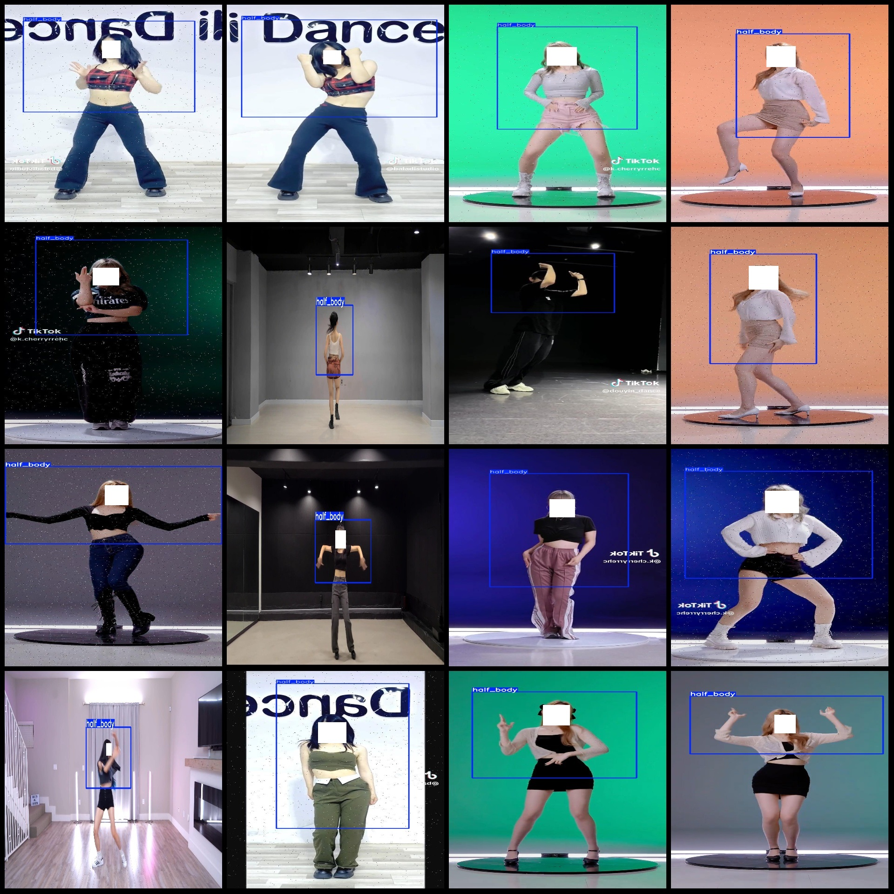
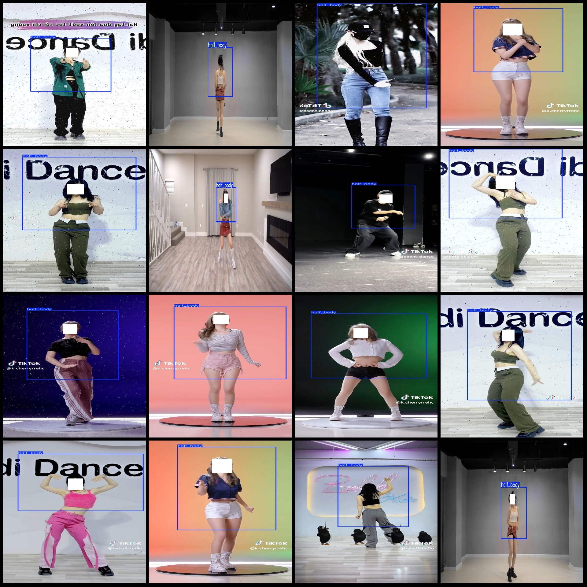

# Human Upper Body Detection Dataset: VOC+YOLO Format, 9924 Images in 1 Class

Dataset format: Pascal VOC format + YOLO format (txt file without segmentation path, only containing jpg images along with corresponding VOC format xml files and yolo format txt files)
Number of images (jpg file count): 9924
Number of annotations (xml file count): 9924
Number of annotations (txt file count): 9924
Number of annotation categories: 1
Annotation category name: ["half_body"]
Number of boxes per category:
half_body box count = 9925
Total box count: 9925
Number of images per category:
half_body images count = 9924
Image resolution: Multi-resolution images, such as 576x1024, 576x1026, etc.
Annotation tool used: labelImg
Annotation rules: draw boxes around the category
Important note: The dataset does not have a training/validation/test split; you need to partition it yourself.
Special declaration: This dataset does not guarantee the accuracy of the trained model or weight files.
Image preview:
Annotation example:

## Images

Here is a pay link on Stripe ( https://buy.stripe.com/3cs8yP7sY87d0vu9AB ). Please contact me lonlonago@foxmail.com after funding $89, and I will send you a complete data files , thank you!

